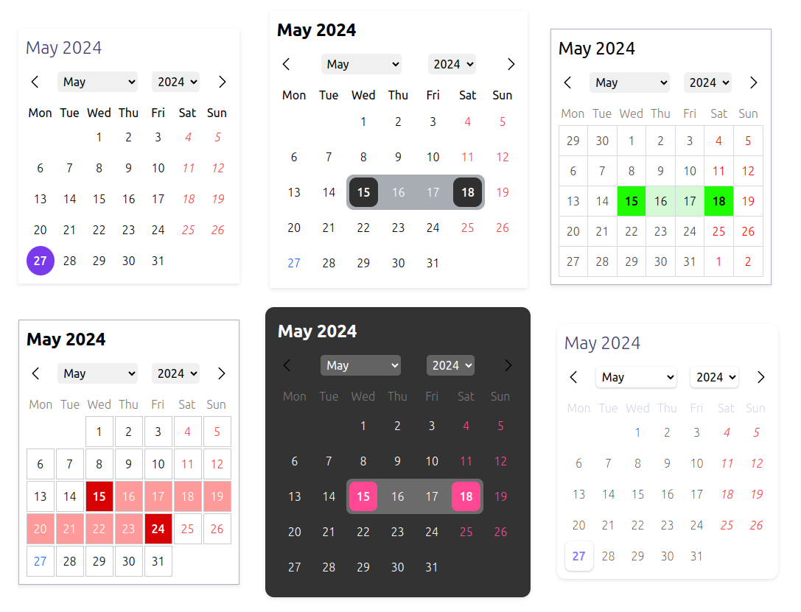
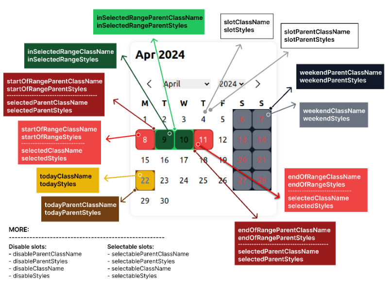
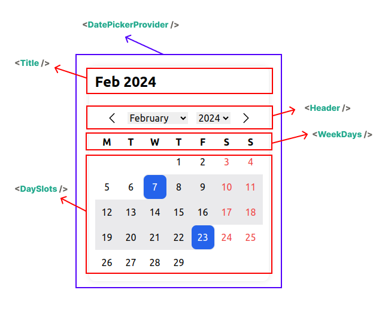

# Headless React Datepicker

[](https://www.npmjs.com/package/headless-react-datepicker)
[](https://www.npmjs.com/package/headless-react-datepicker)
[](https://bundlephobia.com/package/headless-react-datepicker)


> A headless, highly customizable, multi-calendar date picker component for React. It supports various calendars and locales.

## Live demo

https://sepehr09.github.io/headless-react-datepicker/

[](https://codesandbox.io/p/sandbox/headless-react-datepicker-kxjnlr)

## Customization



## Supported Calendars

All calendars are supported by the ECMAScript's [Intl API](https://developer.mozilla.org/en-US/docs/Web/JavaScript/Reference/Global_Objects/Intl/Locale/getCalendars#supported_calendar_types):

- Gregory
- Persian
- Indian
- Iso8601
- Japanese
- Buddhist
- Chinese
- Coptic
- Dangi
- Ethioaa
- Ethiopic
- Hebrew
- Islamic
- Islamic-umalqura
- Islamic-tbla
- Islamic-civil
- Islamic-rgsa
- Islamicc
- Roc

## Supported Locales

All locales are supported by the [Intl API](https://developer.mozilla.org/en-US/docs/Web/JavaScript/Reference/Global_Objects/Intl/Locale/language).

## Installation

### 1. install the package

```bash
npm install headless-react-datepicker

# or

yarn add headless-react-datepicker

# or

pnpm add headless-react-datepicker
```

### 2. import the css file

```jsx
import "headless-react-datepicker/dist/styles.css";
```

## Usage

```jsx
import React from "react";
import DatePickerProvider, {
  Title,
  Header,
  WeekDays,
  DaySlots,
} from "headless-react-datepicker";

const MyAwesomeDatePicker = () => {
  return (
    <DatePickerProvider>
      <Title />
      <Header />
      <WeekDays />
      <DaySlots />
    </DatePickerProvider>
  );
};
```

## Customization



## Headless!



# DatePickerProvider

Must be in place as the parent of the whole calendar component.

```jsx
import { DatePickerProvider } from "headless-react-datepicker";
```

### props

| Name             | Type                            | Description                                                                                                |
| ---------------- | ------------------------------- | ---------------------------------------------------------------------------------------------------------- |
| value            | Date \| Date[]                  | The value of the date picker (Controlled component).                                                       |
| initialValue     | Date \| Date[]                  | The initial value of the date picker.                                                                      |
| defaultStartDate | Date                            | The default start date. Useful when you want to be on a different month or year despite the initial value. |
| config           | TCalendarConfig                 | The configuration for the date picker.                                                                     |
| isRange          | boolean                         | Indicates whether the date picker is a range picker.                                                       |
| calendar         | TCalendar                       | The calendar to use.                                                                                       |
| onChange         | (value: Date \| Date[]) => void | on calendar selected date change                                                                           |
| children         | ReactNode                       | The other parts of the calendar or your custom components.                                                 |

### TCalendarConfig

| Name                | Type                                       | Description                                                                                                        | Default                       |
| ------------------- | ------------------------------------------ | ------------------------------------------------------------------------------------------------------------------ | ----------------------------- |
| weekStartsOn        | TDay \| undefined                          | The first day of the week.                                                                                         | "monday"                      |
| locale              | string \| undefined                        | The locale to use.                                                                                                 | "en-US"                       |
| showOtherDays       | boolean \| undefined                       | Show other days from the previous and next month or not.                                                           | false                         |
| otherDaysSelectable | boolean \| undefined                       | Allow selecting other days from the previous and next month or not.                                                | false                         |
| weekdayFormat       | "long" \| "short" \| "narrow" \| undefined |                                                                                                                    | "narrow"                      |
| dayFormat           | "numeric" \| "2-digit" \| undefined        |                                                                                                                    | "numeric"                     |
| yearRangeFrom       | number \| undefined                        |                                                                                                                    | last 10 years if not provided |
| yearRangeTo         | number \| undefined                        |                                                                                                                    | current year if not provided  |
| maxDate             | Date \| undefined                          | Prevent selecting dates before this date.                                                                          |                               |
| minDate             | Date \| undefined                          | Prevent selecting dates after this date.                                                                           |                               |
| weekends            | TDay[] \| undefined                        | Specify which days of the week are weekend.                                                                        | undefined                     |
| weekendSelectable   | boolean \| undefined                       | Allow selecting weekends or not.                                                                                   | true                          |
| holidays            | TDay[] \| undefined                        | Specify which days of the week are holidays.                                                                       | undefined                     |
| holidaySelectable   | boolean \| undefined                       | Allow selecting holidays or not.                                                                                   | false                         |
| allowBackwardRange  | boolean \| undefined                       | If user select a date before the previous selected date, it will be considered as a range or start from beginning. | false                         |

### TCalendar

"gregory" | "persian" | "islamic" | "islamic-umalqura" | "islamic-tbla" | "islamic-civil" | "islamic-rgsa" | "iso8601" | "japanese" | "islamicc" | "roc" | "chinese" | "indian" | "buddhist" | "coptic" | "dangi" | "ethioaa" | "ethiopic" | "hebrew"

# Components

## Title component

The `Title` component is used to display the month and year based on the selected locale and calendar.

```jsx
import { Title } from "headless-react-datepicker";
```

### props

| Name        | Type                | Options                                            | Default   |
| ----------- | ------------------- | -------------------------------------------------- | --------- |
| monthFormat | string \| undefined | "numeric", "2-digit" , "long" , "short" , "narrow" | "short"   |
| yearFormat  | string \| undefined | "numeric" , "2-digit"                              | "numeric" |
| className   | string              | ClassName of the title component                   |           |
| style       | CSSProperties       | css styles of the title component                  |           |

## Header component

The `Header` component is used to navigate to the next and previous month and select month and year from the drop-down list.

You can customize arrow icons with React Node and the dropdowns with className and CSS stylesheets.

```jsx
import { Header } from "headless-react-datepicker";
```

### props

| Name                         | Type          | Description                                          |
| ---------------------------- | ------------- | ---------------------------------------------------- |
| leftIcon                     | ReactNode     |                                                      |
| rightIcon                    | ReactNode     |                                                      |
| rootClassName                | string        | the root className of the header                     |
| rootStyles                   | CSSProperties | the root css styles of the header                    |
| monthSelectClassName         | string        | Class name of the month select dropdown              |
| monthSelectStyles            | CSSProperties | css styles of the month select dropdown              |
| monthOptionClassName         | string        | className of the month Options in the dropdown       |
| monthOptionStyles            | CSSProperties | css styles of the month Options in the dropdown      |
| monthSelectedOptionClassName | string        | className the selected option in the month dropdown  |
| monthSelectedOptionStyles    | CSSProperties | css styles the selected option in the month dropdown |
| yearSelectClassName          | string        | className of the year select dropdown                |
| yearSelectStyles             | CSSProperties | css styles of the year select dropdown               |
| yearOptionClassName          | string        | className of the year Options in the dropdown        |
| yearOptionStyles             | CSSProperties | css styles of the year Options in the dropdown       |
| yearSelectedOptionClassName  | string        | className the selected option in the year dropdown   |
| yearSelectedOptionStyles     | CSSProperties | css styles the selected option in the year dropdown  |
| prevButtonClassName          | string        | className of the previous button (left button)       |
| prevButtonStyles             | CSSProperties | css styles of the previous button (left button)      |
| nextButtonClassName          | string        | className of the next button (right button)          |
| nextButtonStyles             | CSSProperties | css style of the next button (right button)          |

## WeekDays component

The `WeekDays` component is used to display the weekday header.

```jsx
import { WeekDays } from "headless-react-datepicker";
```

### props

| Name          | Type                                           | Description                                                       |
| ------------- | ---------------------------------------------- | ----------------------------------------------------------------- |
| renderer      | (args: **TWeekDaysRendererArgs**) => ReactNode | Custom renderer. If provided, the whole component will be ignored |
| className     | string                                         | Custom class name for the element                                 |
| style         | CSSProperties                                  | css styles for the element                                        |
| rootClassName | string                                         | Custom class name for the parent root element                     |
| rootStyle     | CSSProperties                                  | css styles for the parent root element                            |

### TWeekDaysRendererArgs

| Name           | Type   | Options                                                                                  | Description                                                                           |
| -------------- | ------ | ---------------------------------------------------------------------------------------- | ------------------------------------------------------------------------------------- |
| formattedTitle | string |                                                                                          | Title based on calendar `config.weekdayFormat` which follows `locale` and `calendar`. |
| weekIndex      | number |                                                                                          |                                                                                       |
| weekDay        | TDay   | "monday" \| "tuesday" \| "wednesday" \| "thursday" \| "friday" \| "saturday" \| "sunday" |                                                                                       |

## DaySlots component

The `DaySlots` component is used to display the month and year based on the selected locale and calendar.

```jsx
import { DaySlots } from "headless-react-datepicker";
```

### props

| Name                           | Type                                              | Description        | Default |
| ------------------------------ | ------------------------------------------------- | ------------------ | ------- |
| dayRenderer                    | (args: **TDaySlotsDayRendererArgs**) => ReactNode | Custom renderer    |         |
| onClickSlot                    | (date: **Date**) => void                          | when click on slot |         |
| parentClassName                | string                                            | parent box         |         |
| parentStyles                   | CSSProperties                                     | parent box         |         |
| slotParentClassName            | string                                            |                    |         |
| slotParentStyles               | CSSProperties                                     |                    |         |
| slotClassName                  | string                                            |                    |         |
| slotStyles                     | CSSProperties                                     |                    |         |
| todayStyles                    | CSSProperties                                     |                    |         |
| todayClassName                 | string                                            |                    |         |
| todayParentStyles              | CSSProperties                                     |                    |         |
| todayParentClassName           | string                                            |                    |         |
| disableStyles                  | CSSProperties                                     |                    |         |
| disableClassName               | string                                            |                    |         |
| disableParentStyles            | CSSProperties                                     |                    |         |
| disableParentClassName         | string                                            |                    |         |
| weekendStyles                  | CSSProperties                                     |                    |         |
| weekendClassName               | string                                            |                    |         |
| weekendParentStyles            | CSSProperties                                     |                    |         |
| weekendParentClassName         | string                                            |                    |         |
| holidayStyles                  | CSSProperties                                     |                    |         |
| holidayClassName               | string                                            |                    |         |
| holidayParentStyles            | CSSProperties                                     |                    |         |
| holidayParentClassName         | string                                            |                    |         |
| selectedStyles                 | CSSProperties                                     |                    |         |
| selectedClassName              | string                                            |                    |         |
| selectedParentStyles           | CSSProperties                                     |                    |         |
| selectedParentClassName        | string                                            |                    |         |
| selectableStyles               | CSSProperties                                     |                    |         |
| selectableClassName            | string                                            |                    |         |
| selectableParentStyles         | CSSProperties                                     |                    |         |
| selectableParentClassName      | string                                            |                    |         |
| inSelectedRangeStyles          | CSSProperties                                     |                    |         |
| inSelectedRangeClassName       | string                                            |                    |         |
| inSelectedRangeParentStyles    | CSSProperties                                     |                    |         |
| inSelectedRangeParentClassName | string                                            |                    |         |
| inHoveredRangeStyles           | CSSProperties                                     |                    |         |
| inHoveredRangeClassName        | string                                            |                    |         |
| inHoveredRangeParentStyles     | CSSProperties                                     |                    |         |
| inHoveredRangeParentClassName  | string                                            |                    |         |
| startOfRangeStyles             | CSSProperties                                     |                    |         |
| startOfRangeClassName          | string                                            |                    |         |
| startOfRangeParentStyles       | CSSProperties                                     |                    |         |
| startOfRangeParentClassName    | string                                            |                    |         |
| endOfRangeStyles               | CSSProperties                                     |                    |         |
| endOfRangeClassName            | string                                            |                    |         |
| endOfRangeParentStyles         | CSSProperties                                     |                    |         |
| endOfRangeParentClassName      | string                                            |                    |         |

### TDaySlotsDayRendererArgs props

| Name              | Type                                                         | Options                                                                          | Default |
| ----------------- | ------------------------------------------------------------ | -------------------------------------------------------------------------------- | ------- |
| date              | Date                                                         | based on calendar `config.dayFormat` which follows `locale` and `calendar`.      |         |
| formattedDay      | string                                                       | Formatted date based on `locale` and `calendar` which is in the calendar config. |         |
| isToday           | boolean                                                      | Indicate that is the day is today or not.                                        |         |
| IsToday           | boolean                                                      | Indicate that is the day is today or not. (For backwards compatibility)          |         |
| isSelectable      | boolean                                                      | Is the day can be selected or not.                                               |         |
| isDisabled        | boolean                                                      | Is the day is disabled or not.                                                   |         |
| isInSelectedRange | boolean                                                      | Is in the selected range (if calendar type is range) or not.                     |         |
| isInHoveredRange  | boolean                                                      | Is in the hovered range (if calendar type is range) or not.                      |         |
| isStartOfRange    | boolean                                                      |                                                                                  |         |
| isEndOfRange      | boolean                                                      |                                                                                  |         |
| isInWeekend       | boolean                                                      |                                                                                  |         |
| isInHoliday       | boolean                                                      |                                                                                  |         |
| isSelected        | boolean                                                      |                                                                                  |         |
| isOtherMonth      | boolean                                                      | Indicate whether a day is in the current month or not                            |         |
| handleClickSlot   | (date: Date) => void                                         |                                                                                  |         |
| handleKeyDown     | (e: React.KeyboardEvent<HTMLDivElement>, date: Date) => void | onKeyDown event                                                                  |         |

# Date picker Context

You can access almost all props and functions of the date picker from the date picker context, so you can customize and build your own custom component easily.

### example

```jsx
import { useDatePickerContext } from "headless-react-datepicker";

const MyCustomAwesomeHeader = () => {
  const { goToCurrentMonth, yearInTheCalendar } = useDatePickerContext();

  return <div onClick={goToCurrentMonth}>{yearInTheCalendar}</div>;
};
```

### returned props

| Name                      | Type                        | Description                                                                                              |
| ------------------------- | --------------------------- | -------------------------------------------------------------------------------------------------------- |
| goToNextMonth             | () => void                  | Function to navigate to the next month                                                                   |
| goToPrevMonth             | () => void                  | Function to navigate to the previous month                                                               |
| goToDate                  | (date: Date) => void        | Function to navigate to a specific date                                                                  |
| goToCurrentMonth          | () => void                  | Function to navigate to the current month                                                                |
| goToMonth                 | (month: number) => void     | Local month (based on the desired calendar)                                                              |
| goToYear                  | (year: number) => void      | Handle go to year (based on desire calendar)                                                             |
| daysOfMonth               | Date[]                      | All the dates of the month rendered in the calendar                                                      |
| startDateIncludeOtherDays | Date                        | End date of the month rendered in the calendar (include previous month days (if in the week))            |
| endDateIncludeOtherDays   | Date                        | Start date of the month rendered in the calendar (include next month days (if in the week))              |
| firstDayOfMonth           | Date                        | First day of the month                                                                                   |
| lastDayOfMonth            | Date                        | Last day of the month                                                                                    |
| selectedDay               | Date \| Date[] \| undefined | The selected day in the calendar                                                                         |
| handleClickSlot           | (date: Date) => void        | Callback function when a date is clicked                                                                 |
| monthInTheCalendar        | number                      | Current month in the calendar (based on desire calendar)                                                 |
| totalDaysInTheCalendar    | number                      | Indicate the total days in the month                                                                     |
| yearInTheCalendar         | number                      | Current year in the desire calendar                                                                      |
| monthsList                | TMonthListItem[]            | List of all month based on culture                                                                       |
| yearsList                 | number[]                    | List of all years based on yearRangeFrom and yearRangeTo                                                 |
| initialValue              | Date \| Date[]              | The initial value of the date picker.                                                                    |
| defaultStartDate          | Date                        | The default start date. Useful when you want to be on different month or year despite the initial value. |
| config                    | TCalendarConfig             | The configuration for the date picker.                                                                   |
| isRange                   | boolean                     | Indicates whether the date picker is a range picker.                                                     |
| calendar                  | TCalendar                   | The calendar to use.                                                                                     |

## Dependencies

Using the [Intl API](https://developer.mozilla.org/en-US/docs/Web/JavaScript/Reference/Global_Objects/Intl/DateTimeFormat) which is ECMAScript Internationalization API with a very good [browser support](https://developer.mozilla.org/en-US/docs/Web/JavaScript/Reference/Global_Objects/Intl/DateTimeFormat#browser_compatibility) and depends on [Temporal](https://www.npmjs.com/package/@js-temporal/polyfill) for converting other calendars into gregory.

## Todo

- [x] remove dependency to date-fns
- [ ] time picker
- [ ] rangle picker hover effect
- [ ] integrate popover for whole calendar
- [ ] two side by side calendar

## License

MIT @ [Sepehr09](https://github.com/sepehr09)

## Contributing

We're eagerly welcoming to contributors who want to help build and maintain this repo. PRs are always welcome!

## Change log

you can see the change log [here](/CHANGELOG.md)
