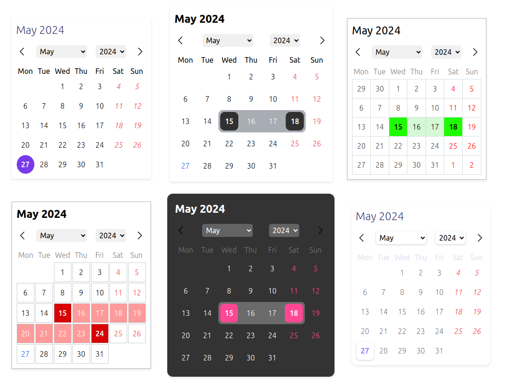
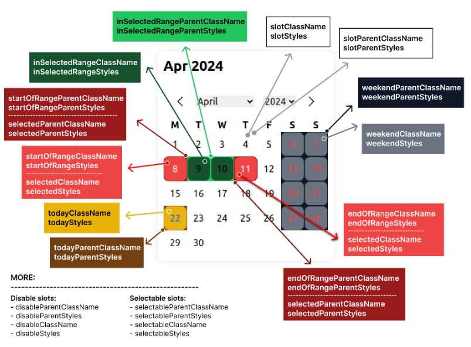
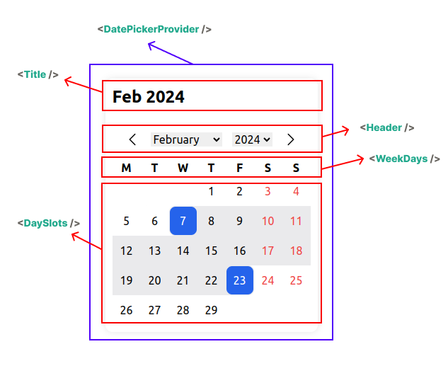

# Headless React Datepicker

[](https://www.npmjs.com/package/headless-react-datepicker)
[](https://www.npmjs.com/package/headless-react-datepicker)
[](https://bundlephobia.com/package/headless-react-datepicker)


> A headless, highly customizable, multi-calendar date picker component for React. It supports various calendars and locales.

## Live demo

https://sepehr09.github.io/headless-react-datepicker/

[](https://codesandbox.io/p/sandbox/headless-react-datepicker-kxjnlr)

## Customization



## Supported Calendars

All calendars are supported by the ECMAScript's [Intl API](https://developer.mozilla.org/en-US/docs/Web/JavaScript/Reference/Global_Objects/Intl/Locale/getCalendars#supported_calendar_types):

- Gregory
- Persian
- Indian
- Iso8601
- Japanese
- Buddhist
- Chinese
- Coptic
- Dangi
- Ethioaa
- Ethiopic
- Hebrew
- Islamic
- Islamic-umalqura
- Islamic-tbla
- Islamic-civil
- Islamic-rgsa
- Islamicc
- Roc

## Supported Locales

All locales are supported by the [Intl API](https://developer.mozilla.org/en-US/docs/Web/JavaScript/Reference/Global_Objects/Intl/Locale/language).

## Installation

### 1. install the package

```bash
npm install headless-react-datepicker

# or

yarn add headless-react-datepicker

# or

pnpm add headless-react-datepicker
```

### 2. import the css file

```jsx
import "headless-react-datepicker/dist/styles.css";
```

## Usage

```jsx
import React from "react";
import DatePickerProvider, {
  Title,
  Header,
  WeekDays,
  DaySlots,
} from "headless-react-datepicker";

const MyAwesomeDatePicker = () => {
  return (
    <DatePickerProvider>
      <Title />
      <Header />
      <WeekDays />
      <DaySlots />
    </DatePickerProvider>
  );
};
```

## Two side-by-side calendars

Render two (or more) months at once by passing a `monthOffset` to `Title` and
`DaySlots`. A single `DatePickerProvider` drives all of them, so navigation moves
every month together and range selection / hover spans across the calendars.

Set `navigationStep={2}` on the `Header` so the prev/next arrows move both months at once.

```jsx
import DatePickerProvider, {
  Title,
  Header,
  WeekDays,
  DaySlots,
} from "headless-react-datepicker";

const DualCalendar = () => {
  return (
    <DatePickerProvider isRange>
      {/* one header navigates both months (2 months per click) */}
      <Header navigationStep={2} />

      <div style={{ display: "flex", gap: 24 }}>
        {/* current month */}
        <div>
          <Title />
          <WeekDays />
          <DaySlots />
        </div>

        {/* next month */}
        <div>
          <Title monthOffset={1} />
          <WeekDays />
          <DaySlots monthOffset={1} />
        </div>
      </div>
    </DatePickerProvider>
  );
};
```

## Customization



## Headless!



## Styling with plain CSS (no Tailwind / no inline styles)

Besides the `className` / `style` props and the render props, every component
emits **stable BEM-style class hooks** so you can style the whole calendar from
a plain CSS file — no Tailwind and no inline styles required. State is exposed
as `--modifier` classes (e.g. `--selected`, `--today`, `--disabled`).

If you want full control, simply **don't import `dist/styles.css`** (that file
only carries the default Tailwind look) and target the hooks yourself:

```css
/* a day cell */
.rhmdp-daySlots__day {
  padding: 8px;
  border-radius: 8px;
  cursor: pointer;
}
.rhmdp-daySlots__day--today {
  color: #2563eb;
}
.rhmdp-daySlots__day--selected {
  background: #2563eb;
  color: #fff;
}
.rhmdp-daySlots__day--in-range {
  background: #eaeaec;
}
.rhmdp-daySlots__day--disabled {
  cursor: not-allowed;
  opacity: 0.4;
}
```

### Class hook reference

| Component       | Base class(es)                                                                                                   | State modifiers (`base--modifier`)                                                                                                          |
| --------------- | --------------------------------------------------------------------------------------------------------------- | ------------------------------------------------------------------------------------------------------------------------------------------ |
| **DaySlots**    | `.rhmdp-daySlots` (grid), `.rhmdp-daySlots__cell` (wrapper), `.rhmdp-daySlots__day`, `.rhmdp-daySlots__placeholder` | on both `__cell` and `__day`: `--today`, `--selected`, `--selectable`, `--disabled`, `--weekend`, `--holiday`, `--other-month`, `--in-range`, `--in-hovered-range`, `--range-start`, `--range-end`, `--first-of-month`; plus `__cell--empty` |
| **WeekDays**    | `.rhmdp-weekDays`, `.rhmdp-weekDays__day`                                                                        | `--monday` … `--sunday`, `--weekend`                                                                                                        |
| **Header**      | `.rhmdp-header`, `__prevButton`, `__nextButton`, `__monthSelect`, `__yearSelect`, `__monthOption`, `__yearOption` | `__monthOption--selected`, `__yearOption--selected`                                                                                         |
| **PanelHeader** | `.rhmdp-panelHeader`, `__prevButton`, `__nextButton`, `__label`, `__grid`, `__cell`                              | root `--days` / `--months` / `--years`; `__cell--selected`                                                                                  |
| **Title**       | `.rhmdp-title`                                                                                                   |                                                                                                                                            |
| **TimePicker**  | `.rhmdp-timePicker`, `__column`, `__button`, `__value`, `__option`, `__separator`                                | `__column--hours` / `--minutes` / `--seconds` / `--period`; `__button--up` / `--down`                                                       |

> These hooks are additive — the `className` / `style` props and the Tailwind
> defaults keep working exactly as before.

# DatePickerProvider

Must be in place as the parent of the whole calendar component.

```jsx
import { DatePickerProvider } from "headless-react-datepicker";
```

### props

| Name             | Type                            | Description                                                                                                |
| ---------------- | ------------------------------- | ---------------------------------------------------------------------------------------------------------- |
| value            | Date \| Date[]                  | The value of the date picker (Controlled component).                                                       |
| initialValue     | Date \| Date[]                  | The initial value of the date picker.                                                                      |
| defaultStartDate | Date                            | The default start date. Useful when you want to be on a different month or year despite the initial value. |
| config           | TCalendarConfig                 | The configuration for the date picker.                                                                     |
| isRange          | boolean                         | Indicates whether the date picker is a range picker.                                                       |
| calendar         | TCalendar                       | The calendar to use.                                                                                       |
| onChange         | (value: Date \| Date[]) => void | on calendar selected date change                                                                           |
| children         | ReactNode                       | The other parts of the calendar or your custom components.                                                 |

### TCalendarConfig

| Name                | Type                                       | Description                                                                                                        | Default                       |
| ------------------- | ------------------------------------------ | ------------------------------------------------------------------------------------------------------------------ | ----------------------------- |
| weekStartsOn        | TDay \| undefined                          | The first day of the week.                                                                                         | "monday"                      |
| locale              | string \| undefined                        | The locale to use.                                                                                                 | "en-US"                       |
| showOtherDays       | boolean \| undefined                       | Show other days from the previous and next month or not.                                                           | false                         |
| otherDaysSelectable | boolean \| undefined                       | Allow selecting other days from the previous and next month or not.                                                | false                         |
| weekdayFormat       | "long" \| "short" \| "narrow" \| undefined |                                                                                                                    | "narrow"                      |
| dayFormat           | "numeric" \| "2-digit" \| undefined        |                                                                                                                    | "numeric"                     |
| yearRangeFrom       | number \| undefined                        |                                                                                                                    | last 10 years if not provided |
| yearRangeTo         | number \| undefined                        |                                                                                                                    | current year if not provided  |
| maxDate             | Date \| undefined                          | Prevent selecting dates before this date.                                                                          |                               |
| minDate             | Date \| undefined                          | Prevent selecting dates after this date.                                                                           |                               |
| weekends            | TDay[] \| undefined                        | Specify which days of the week are weekend.                                                                        | undefined                     |
| weekendSelectable   | boolean \| undefined                       | Allow selecting weekends or not.                                                                                   | true                          |
| holidays            | TDay[] \| undefined                        | Specify which days of the week are holidays.                                                                       | undefined                     |
| holidaySelectable   | boolean \| undefined                       | Allow selecting holidays or not.                                                                                   | false                         |
| allowBackwardRange  | boolean \| undefined                       | If user select a date before the previous selected date, it will be considered as a range or start from beginning. | false                         |

### TCalendar

"gregory" | "persian" | "islamic" | "islamic-umalqura" | "islamic-tbla" | "islamic-civil" | "islamic-rgsa" | "iso8601" | "japanese" | "islamicc" | "roc" | "chinese" | "indian" | "buddhist" | "coptic" | "dangi" | "ethioaa" | "ethiopic" | "hebrew"

# Components

## Title component

The `Title` component is used to display the month and year based on the selected locale and calendar.

```jsx
import { Title } from "headless-react-datepicker";
```

### props

| Name        | Type                | Options                                                                                                                 | Default   |
| ----------- | ------------------- | ----------------------------------------------------------------------------------------------------------------------- | --------- |
| monthFormat | string \| undefined | "numeric", "2-digit" , "long" , "short" , "narrow"                                                                      | "short"   |
| yearFormat  | string \| undefined | "numeric" , "2-digit"                                                                                                   | "numeric" |
| monthOffset | number \| undefined | Show the title of a month offset from the current one (e.g. `1` for the next month). Useful for side-by-side calendars. | 0         |
| className   | string              | ClassName of the title component                                                                                        |           |
| style       | CSSProperties       | css styles of the title component                                                                                       |           |

## Header component

The `Header` component is used to navigate to the next and previous month and select month and year from the drop-down list.

You can customize arrow icons with React Node and the dropdowns with className and CSS stylesheets.

```jsx
import { Header } from "headless-react-datepicker";
```

### props

| Name                         | Type          | Description                                                                                                |
| ---------------------------- | ------------- | ---------------------------------------------------------------------------------------------------------- |
| navigationStep               | number        | Number of months the prev/next arrows move per click (default `1`). Set to `2` for side-by-side calendars. |
| leftIcon                     | ReactNode     |                                                                                                            |
| rightIcon                    | ReactNode     |                                                                                                            |
| rootClassName                | string        | the root className of the header                                                                           |
| rootStyles                   | CSSProperties | the root css styles of the header                                                                          |
| monthSelectClassName         | string        | Class name of the month select dropdown                                                                    |
| monthSelectStyles            | CSSProperties | css styles of the month select dropdown                                                                    |
| monthOptionClassName         | string        | className of the month Options in the dropdown                                                             |
| monthOptionStyles            | CSSProperties | css styles of the month Options in the dropdown                                                            |
| monthSelectedOptionClassName | string        | className the selected option in the month dropdown                                                        |
| monthSelectedOptionStyles    | CSSProperties | css styles the selected option in the month dropdown                                                       |
| yearSelectClassName          | string        | className of the year select dropdown                                                                      |
| yearSelectStyles             | CSSProperties | css styles of the year select dropdown                                                                     |
| yearOptionClassName          | string        | className of the year Options in the dropdown                                                              |
| yearOptionStyles             | CSSProperties | css styles of the year Options in the dropdown                                                             |
| yearSelectedOptionClassName  | string        | className the selected option in the year dropdown                                                         |
| yearSelectedOptionStyles     | CSSProperties | css styles the selected option in the year dropdown                                                        |
| prevButtonClassName          | string        | className of the previous button (left button)                                                             |
| prevButtonStyles             | CSSProperties | css styles of the previous button (left button)                                                            |
| nextButtonClassName          | string        | className of the next button (right button)                                                                |
| nextButtonStyles             | CSSProperties | css style of the next button (right button)                                                                |

## PanelHeader component

The `PanelHeader` component is a self-contained alternative to `Header`. Instead of `<select>` dropdowns, it shows the month and year pickers **inside the calendar area**: clicking the month opens a grid of all 12 months, and clicking the year opens a paginated grid of years with prev/next page arrows.

Wrap your day-view content (`WeekDays` / `DaySlots`) as its children — it swaps them for the month/year grids while navigating and restores them on selection. It works across all calendars and locales out of the box.

```jsx
import DatePickerProvider, {
  PanelHeader,
  WeekDays,
  DaySlots,
} from "headless-react-datepicker";

const MyDatePicker = () => (
  <DatePickerProvider>
    <PanelHeader>
      <WeekDays />
      <DaySlots />
    </PanelHeader>
  </DatePickerProvider>
);
```

### props

| Name                  | Type          | Description                                                                 | Default |
| --------------------- | ------------- | --------------------------------------------------------------------------- | ------- |
| children              | ReactNode     | The day-view content, shown in the `"days"` view (e.g. WeekDays/DaySlots)   |         |
| yearsPerPage          | number        | Number of years shown per page in the year grid; arrows move by this amount | 12      |
| leftIcon              | ReactNode     | Replace the previous (left) arrow icon                                      |         |
| rightIcon             | ReactNode     | Replace the next (right) arrow icon                                         |         |
| rootClassName         | string        | className of the panel header root row                                      |         |
| rootStyles            | CSSProperties | css styles of the panel header root row                                     |         |
| prevButtonClassName   | string        | className of the previous button (left button)                              |         |
| prevButtonStyles      | CSSProperties | css styles of the previous button (left button)                             |         |
| nextButtonClassName   | string        | className of the next button (right button)                                 |         |
| nextButtonStyles      | CSSProperties | css styles of the next button (right button)                                |         |
| labelClassName        | string        | className of the center label(s) (month name / year that toggle the views)  |         |
| labelStyles           | CSSProperties | css styles of the center label(s)                                           |         |
| gridClassName         | string        | className of the month/year grid container                                  |         |
| gridStyles            | CSSProperties | css styles of the month/year grid container                                 |         |
| cellClassName         | string        | className of a single month/year cell                                       |         |
| cellStyles            | CSSProperties | css styles of a single month/year cell                                      |         |
| selectedCellClassName | string        | className of the currently selected month/year cell                         |         |
| selectedCellStyles    | CSSProperties | css styles of the currently selected month/year cell                        |         |

## WeekDays component

The `WeekDays` component is used to display the weekday header.

```jsx
import { WeekDays } from "headless-react-datepicker";
```

### props

| Name          | Type                                           | Description                                                       |
| ------------- | ---------------------------------------------- | ----------------------------------------------------------------- |
| renderer      | (args: **TWeekDaysRendererArgs**) => ReactNode | Custom renderer. If provided, the whole component will be ignored |
| className     | string                                         | Custom class name for the element                                 |
| style         | CSSProperties                                  | css styles for the element                                        |
| rootClassName | string                                         | Custom class name for the parent root element                     |
| rootStyle     | CSSProperties                                  | css styles for the parent root element                            |

### TWeekDaysRendererArgs

| Name           | Type   | Options                                                                                  | Description                                                                           |
| -------------- | ------ | ---------------------------------------------------------------------------------------- | ------------------------------------------------------------------------------------- |
| formattedTitle | string |                                                                                          | Title based on calendar `config.weekdayFormat` which follows `locale` and `calendar`. |
| weekIndex      | number |                                                                                          |                                                                                       |
| weekDay        | TDay   | "monday" \| "tuesday" \| "wednesday" \| "thursday" \| "friday" \| "saturday" \| "sunday" |                                                                                       |

## DaySlots component

The `DaySlots` component is used to display the month and year based on the selected locale and calendar.

```jsx
import { DaySlots } from "headless-react-datepicker";
```

### props

| Name                           | Type                                              | Description                                                                                                  | Default |
| ------------------------------ | ------------------------------------------------- | ------------------------------------------------------------------------------------------------------------ | ------- |
| dayRenderer                    | (args: **TDaySlotsDayRendererArgs**) => ReactNode | Custom renderer                                                                                              |         |
| onClickSlot                    | (date: **Date**) => void                          | when click on slot                                                                                           |         |
| monthOffset                    | number                                            | Render a month offset from the current one (e.g. `1` for the next month). Useful for side-by-side calendars. | 0       |
| parentClassName                | string                                            | parent box                                                                                                   |         |
| parentStyles                   | CSSProperties                                     | parent box                                                                                                   |         |
| slotParentClassName            | string                                            |                                                                                                              |         |
| slotParentStyles               | CSSProperties                                     |                                                                                                              |         |
| slotClassName                  | string                                            |                                                                                                              |         |
| slotStyles                     | CSSProperties                                     |                                                                                                              |         |
| todayStyles                    | CSSProperties                                     |                                                                                                              |         |
| todayClassName                 | string                                            |                                                                                                              |         |
| todayParentStyles              | CSSProperties                                     |                                                                                                              |         |
| todayParentClassName           | string                                            |                                                                                                              |         |
| disableStyles                  | CSSProperties                                     |                                                                                                              |         |
| disableClassName               | string                                            |                                                                                                              |         |
| disableParentStyles            | CSSProperties                                     |                                                                                                              |         |
| disableParentClassName         | string                                            |                                                                                                              |         |
| weekendStyles                  | CSSProperties                                     |                                                                                                              |         |
| weekendClassName               | string                                            |                                                                                                              |         |
| weekendParentStyles            | CSSProperties                                     |                                                                                                              |         |
| weekendParentClassName         | string                                            |                                                                                                              |         |
| holidayStyles                  | CSSProperties                                     |                                                                                                              |         |
| holidayClassName               | string                                            |                                                                                                              |         |
| holidayParentStyles            | CSSProperties                                     |                                                                                                              |         |
| holidayParentClassName         | string                                            |                                                                                                              |         |
| selectedStyles                 | CSSProperties                                     |                                                                                                              |         |
| selectedClassName              | string                                            |                                                                                                              |         |
| selectedParentStyles           | CSSProperties                                     |                                                                                                              |         |
| selectedParentClassName        | string                                            |                                                                                                              |         |
| selectableStyles               | CSSProperties                                     |                                                                                                              |         |
| selectableClassName            | string                                            |                                                                                                              |         |
| selectableParentStyles         | CSSProperties                                     |                                                                                                              |         |
| selectableParentClassName      | string                                            |                                                                                                              |         |
| inSelectedRangeStyles          | CSSProperties                                     |                                                                                                              |         |
| inSelectedRangeClassName       | string                                            |                                                                                                              |         |
| inSelectedRangeParentStyles    | CSSProperties                                     |                                                                                                              |         |
| inSelectedRangeParentClassName | string                                            |                                                                                                              |         |
| inHoveredRangeStyles           | CSSProperties                                     |                                                                                                              |         |
| inHoveredRangeClassName        | string                                            |                                                                                                              |         |
| inHoveredRangeParentStyles     | CSSProperties                                     |                                                                                                              |         |
| inHoveredRangeParentClassName  | string                                            |                                                                                                              |         |
| startOfRangeStyles             | CSSProperties                                     |                                                                                                              |         |
| startOfRangeClassName          | string                                            |                                                                                                              |         |
| startOfRangeParentStyles       | CSSProperties                                     |                                                                                                              |         |
| startOfRangeParentClassName    | string                                            |                                                                                                              |         |
| endOfRangeStyles               | CSSProperties                                     |                                                                                                              |         |
| endOfRangeClassName            | string                                            |                                                                                                              |         |
| endOfRangeParentStyles         | CSSProperties                                     |                                                                                                              |         |
| endOfRangeParentClassName      | string                                            |                                                                                                              |         |

### TDaySlotsDayRendererArgs props

| Name              | Type                                                         | Options                                                                          | Default |
| ----------------- | ------------------------------------------------------------ | -------------------------------------------------------------------------------- | ------- |
| date              | Date                                                         | based on calendar `config.dayFormat` which follows `locale` and `calendar`.      |         |
| formattedDay      | string                                                       | Formatted date based on `locale` and `calendar` which is in the calendar config. |         |
| isToday           | boolean                                                      | Indicate that is the day is today or not.                                        |         |
| IsToday           | boolean                                                      | Indicate that is the day is today or not. (For backwards compatibility)          |         |
| isSelectable      | boolean                                                      | Is the day can be selected or not.                                               |         |
| isDisabled        | boolean                                                      | Is the day is disabled or not.                                                   |         |
| isInSelectedRange | boolean                                                      | Is in the selected range (if calendar type is range) or not.                     |         |
| isInHoveredRange  | boolean                                                      | Is in the hovered range (if calendar type is range) or not.                      |         |
| isStartOfRange    | boolean                                                      |                                                                                  |         |
| isEndOfRange      | boolean                                                      |                                                                                  |         |
| isInWeekend       | boolean                                                      |                                                                                  |         |
| isInHoliday       | boolean                                                      |                                                                                  |         |
| isSelected        | boolean                                                      |                                                                                  |         |
| isOtherMonth      | boolean                                                      | Indicate whether a day is in the current month or not                            |         |
| handleClickSlot   | (date: Date) => void                                         |                                                                                  |         |
| handleKeyDown     | (e: React.KeyboardEvent<HTMLDivElement>, date: Date) => void | onKeyDown event                                                                  |         |

## TimePicker component

The `TimePicker` component lets the user set the time (hours/minutes, with optional seconds and a 12-hour AM/PM toggle) of the **currently selected day**. It edits the time portion of the selected `Date` while keeping the day, and picking a different day in the calendar **keeps the chosen time**.

By default it renders a row of steppers (▲ value ▼) per unit, and clicking the value itself opens a **native `<select>` dropdown** to pick from a list (disable with `dropdown={false}` for a plain value). Like every other part of the library it's headless: pass a `renderer` to replace the UI entirely, or use the granular `className` / `styles` props to restyle the default one. Digits and the AM/PM label follow the calendar `locale` (e.g. Persian digits for `fa-IR`).

```jsx
import DatePickerProvider, {
  Title,
  Header,
  WeekDays,
  DaySlots,
  TimePicker,
} from "headless-react-datepicker";

const DateTimePicker = () => (
  <DatePickerProvider initialValue={new Date()}>
    <Title />
    <Header />
    <WeekDays />
    <DaySlots />
    <TimePicker showSeconds use12Hours />
  </DatePickerProvider>
);
```

For a **range** picker, render one `TimePicker` per end and target it with `index` (`0` = start, `1` = end):

```jsx
<TimePicker index={0} /> {/* edits the range start's time */}
<TimePicker index={1} /> {/* edits the range end's time */}
```

### props

| Name                | Type                                             | Description                                                                                                | Default |
| ------------------- | ------------------------------------------------ | ---------------------------------------------------------------------------------------------------------- | ------- |
| index               | number                                           | Which end of a range to edit (`0` = start, `1` = end). Ignored for single pickers.                         | 0       |
| use12Hours          | boolean                                          | Use a 12-hour clock with an AM/PM toggle instead of a 24-hour clock.                                       | false   |
| showSeconds         | boolean                                          | Show a seconds column.                                                                                     | false   |
| dropdown            | boolean                                          | Make each value a native `<select>` (clickable, in addition to the arrows). Set `false` for a plain value. | true    |
| renderer            | (args: **TTimePickerRendererArgs**) => ReactNode | Custom renderer. If provided, the built-in stepper UI is ignored.                                          |         |
| upIcon              | ReactNode                                        | Replace the increment (up) arrow icon.                                                                     |         |
| downIcon            | ReactNode                                        | Replace the decrement (down) arrow icon.                                                                   |         |
| rootClassName       | string                                           | className of the time picker root row                                                                      |         |
| rootStyles          | CSSProperties                                    | css styles of the time picker root row                                                                     |         |
| columnClassName     | string                                           | className of a single unit column (hours / minutes / seconds / period)                                     |         |
| columnStyles        | CSSProperties                                    | css styles of a single unit column                                                                         |         |
| buttonClassName     | string                                           | className of both stepper buttons                                                                          |         |
| buttonStyles        | CSSProperties                                    | css styles of both stepper buttons                                                                         |         |
| upButtonClassName   | string                                           | className of the up (increment) stepper button                                                             |         |
| upButtonStyles      | CSSProperties                                    | css styles of the up (increment) stepper button                                                            |         |
| downButtonClassName | string                                           | className of the down (decrement) stepper button                                                           |         |
| downButtonStyles    | CSSProperties                                    | css styles of the down (decrement) stepper button                                                          |         |
| valueClassName      | string                                           | className of the value in the middle of a column (the text or `<select>`)                                  |         |
| valueStyles         | CSSProperties                                    | css styles of the value in the middle of a column (the text or `<select>`)                                 |         |
| optionClassName     | string                                           | className of the `<option>`s in the value dropdown (when `dropdown`)                                       |         |
| optionStyles        | CSSProperties                                    | css styles of the `<option>`s in the value dropdown (when `dropdown`)                                      |         |
| separatorClassName  | string                                           | className of the ":" separators between columns                                                            |         |
| separatorStyles     | CSSProperties                                    | css styles of the ":" separators between columns                                                           |         |
| periodClassName     | string                                           | className of the AM/PM toggle column                                                                       |         |
| periodStyles        | CSSProperties                                    | css styles of the AM/PM toggle column                                                                      |         |

### TTimePickerRendererArgs

| Name        | Type                                          | Description                                                                   |
| ----------- | --------------------------------------------- | ----------------------------------------------------------------------------- |
| date        | Date \| undefined                             | The date whose time is being edited, or `undefined` when nothing is selected. |
| hours       | number                                        | Hour in 24-hour form (`0..23`).                                               |
| minutes     | number                                        | Minute (`0..59`).                                                             |
| seconds     | number                                        | Second (`0..59`).                                                             |
| hours12     | number                                        | Hour in 12-hour form (`1..12`). Only meaningful when `use12Hours`.            |
| period      | "AM" \| "PM"                                  | AM/PM for the current hour.                                                   |
| use12Hours  | boolean                                       | Whether the picker is in 12-hour mode.                                        |
| showSeconds | boolean                                       | Whether the seconds column is shown.                                          |
| formatted   | string                                        | Localized time string (e.g. `"09:30"`, `"09:30:00"`, `"09:30 AM"`).           |
| setHours    | (hours: number) => void                       | Set the hour (24-hour value, wraps `0..23`).                                  |
| setMinutes  | (minutes: number) => void                     | Set the minute (wraps `0..59`).                                               |
| setSeconds  | (seconds: number) => void                     | Set the second (wraps `0..59`).                                               |
| setPeriod   | (period: "AM" \| "PM") => void                | Set AM/PM, keeping the displayed 12-hour value.                               |
| increment   | (unit: "hours"\|"minutes"\|"seconds") => void | Step a unit up by one with wrap-around.                                       |
| decrement   | (unit: "hours"\|"minutes"\|"seconds") => void | Step a unit down by one with wrap-around.                                     |

# Date picker Context

You can access almost all props and functions of the date picker from the date picker context, so you can customize and build your own custom component easily.

### example

```jsx
import { useDatePickerContext } from "headless-react-datepicker";

const MyCustomAwesomeHeader = () => {
  const { goToCurrentMonth, yearInTheCalendar } = useDatePickerContext();

  return <div onClick={goToCurrentMonth}>{yearInTheCalendar}</div>;
};
```

### returned props

| Name                      | Type                                                                                    | Description                                                                                               |
| ------------------------- | --------------------------------------------------------------------------------------- | --------------------------------------------------------------------------------------------------------- |
| goToNextMonth             | (step?: number) => void                                                                 | Function to navigate to the next month (`step` months forward, default `1`)                               |
| goToPrevMonth             | (step?: number) => void                                                                 | Function to navigate to the previous month (`step` months back, default `1`)                              |
| goToDate                  | (date: Date) => void                                                                    | Function to navigate to a specific date                                                                   |
| goToCurrentMonth          | () => void                                                                              | Function to navigate to the current month                                                                 |
| goToMonth                 | (month: number) => void                                                                 | Local month (based on the desired calendar)                                                               |
| goToYear                  | (year: number) => void                                                                  | Handle go to year (based on desire calendar)                                                              |
| daysOfMonth               | Date[]                                                                                  | All the dates of the month rendered in the calendar                                                       |
| startDateIncludeOtherDays | Date                                                                                    | End date of the month rendered in the calendar (include previous month days (if in the week))             |
| endDateIncludeOtherDays   | Date                                                                                    | Start date of the month rendered in the calendar (include next month days (if in the week))               |
| firstDayOfMonth           | Date                                                                                    | First day of the month                                                                                    |
| lastDayOfMonth            | Date                                                                                    | Last day of the month                                                                                     |
| selectedDay               | Date \| Date[] \| undefined                                                             | The selected day in the calendar                                                                          |
| handleClickSlot           | (date: Date) => void                                                                    | Callback function when a date is clicked                                                                  |
| handleChangeTime          | (time: { hours?: number; minutes?: number; seconds? : number }, index?: number) => void | Set the time of the current selection while keeping its day. `index` picks the range end (`0`/`1`).       |
| hoveredDate               | Date \| undefined                                                                       | The date currently hovered while picking a range (shared across side-by-side calendars)                   |
| handleHoverSlot           | (date?: Date) => void                                                                   | Callback when a day is hovered while picking a range. Pass `undefined` to clear (shared across calendars) |
| monthInTheCalendar        | number                                                                                  | Current month in the calendar (based on desire calendar)                                                  |
| totalDaysInTheCalendar    | number                                                                                  | Indicate the total days in the month                                                                      |
| yearInTheCalendar         | number                                                                                  | Current year in the desire calendar                                                                       |
| monthsList                | TMonthListItem[]                                                                        | List of all month based on culture                                                                        |
| yearsList                 | number[]                                                                                | List of all years based on yearRangeFrom and yearRangeTo                                                  |
| initialValue              | Date \| Date[]                                                                          | The initial value of the date picker.                                                                     |
| defaultStartDate          | Date                                                                                    | The default start date. Useful when you want to be on different month or year despite the initial value.  |
| config                    | TCalendarConfig                                                                         | The configuration for the date picker.                                                                    |
| isRange                   | boolean                                                                                 | Indicates whether the date picker is a range picker.                                                      |
| calendar                  | TCalendar                                                                               | The calendar to use.                                                                                      |

## Dependencies

Using the [Intl API](https://developer.mozilla.org/en-US/docs/Web/JavaScript/Reference/Global_Objects/Intl/DateTimeFormat) which is ECMAScript Internationalization API with a very good [browser support](https://developer.mozilla.org/en-US/docs/Web/JavaScript/Reference/Global_Objects/Intl/DateTimeFormat#browser_compatibility) and depends on [Temporal](https://www.npmjs.com/package/@js-temporal/polyfill) for converting other calendars into gregory.

## License

MIT @ [Sepehr09](https://github.com/sepehr09)

## Contributing

We're eagerly welcoming to contributors who want to help build and maintain this repo. PRs are always welcome!

## Change log

you can see the change log [here](/CHANGELOG.md)
