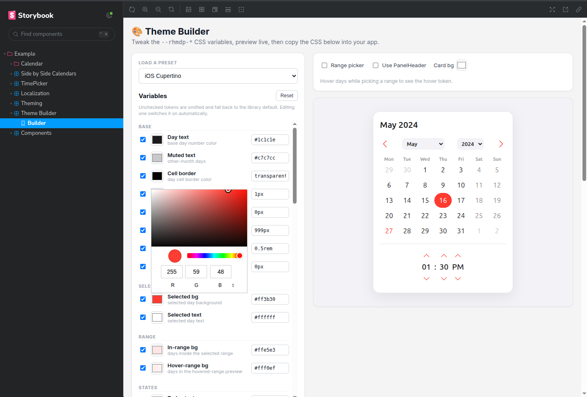

# Headless React Datepicker

[](https://www.npmjs.com/package/headless-react-datepicker)
[](https://www.npmjs.com/package/headless-react-datepicker)
[](https://bundlephobia.com/package/headless-react-datepicker)


> A headless, highly customizable, multi-calendar date picker for React, with first-class support for many calendars and locales.


## Features

- **Headless & composable** — every part is a separate, reorderable component you can lay out however you like.
- **19+ calendars** via the native [Intl API](https://developer.mozilla.org/en-US/docs/Web/JavaScript/Reference/Global_Objects/Intl/Locale/getCalendars#supported_calendar_types) (Persian/Jalali, Islamic, Hebrew, Buddhist, Japanese, …) and **all locales**.
- **Single & range** selection, including backward-range support.
- **Side-by-side / multi-month** calendars driven by a single provider.
- Built-in **time picker** (12/24-hour, optional seconds, AM/PM).
- Theme with **CSS variables** or restyle every part via stable **BEM class hooks** — no Tailwind, no `!important`.
- **TypeScript-first** and dependency-light (only the Temporal polyfill).

## Live demo

- **Storybook:** https://sepehr09.github.io/headless-react-datepicker/
- **Theme Builder:** [open the story](https://sepehr09.github.io/headless-react-datepicker/iframe.html?id=example-theme-builder--builder&viewMode=story)
- **CodeSandbox:** [](https://codesandbox.io/p/sandbox/headless-react-datepicker-kxjnlr)

## Table of contents

- [Headless React Datepicker](#headless-react-datepicker)
  - [Features](#features)
  - [Live demo](#live-demo)
  - [Table of contents](#table-of-contents)
  - [Installation](#installation)
    - [1. Install the package](#1-install-the-package)
    - [2. Import the CSS file](#2-import-the-css-file)
  - [Usage](#usage)
  - [Headless architecture](#headless-architecture)
  - [Theming with CSS variables](#theming-with-css-variables)
    - [CSS variable reference](#css-variable-reference)
  - [Styling with plain CSS](#styling-with-plain-css)
    - [Class hook reference](#class-hook-reference)
  - [Two side-by-side calendars](#two-side-by-side-calendars)
  - [DatePickerProvider](#datepickerprovider)
    - [Props](#props)
    - [TCalendarConfig](#tcalendarconfig)
    - [TCalendar](#tcalendar)
  - [Components](#components)
    - [Title](#title)
      - [Props](#props-1)
    - [Header](#header)
      - [Props](#props-2)
      - [Composable header parts](#composable-header-parts)
    - [PanelHeader](#panelheader)
      - [Props](#props-3)
      - [Composable panel-header parts](#composable-panel-header-parts)
    - [WeekDays](#weekdays)
      - [Props](#props-4)
    - [DaySlots](#dayslots)
      - [Props](#props-5)
    - [TimePicker](#timepicker)
      - [Props](#props-6)
  - [Date picker context](#date-picker-context)
    - [Returned values](#returned-values)
  - [Dependencies](#dependencies)
  - [Browser support](#browser-support)
  - [Contributing](#contributing)
  - [Changelog](#changelog)
  - [License](#license)

## Installation

### 1. Install the package

```bash
npm install headless-react-datepicker
# or
pnpm add headless-react-datepicker
# or
yarn add headless-react-datepicker
```

### 2. Import the CSS file

```jsx
import "headless-react-datepicker/styles.css";
```

This default stylesheet is a **safe fallback**: it lives in a low CSS cascade
layer (`@layer rhmdp`) and every rule is zero-specificity (`:where(...)`), so any
`className` (e.g. a Tailwind utility) or inline `style` you apply **always wins**
— even though you import it after your own CSS. Theming via `--rhmdp-*` variables
is unaffected. If you use [Tailwind v4](https://tailwindcss.com/)'s native cascade
layers, you can pin the order explicitly:

```css
@layer rhmdp, theme, base, components, utilities;
```

## Usage

```jsx
import React from "react";
import DatePickerProvider, {
  Title,
  Header,
  WeekDays,
  DaySlots,
} from "headless-react-datepicker";

const MyAwesomeDatePicker = () => {
  return (
    <DatePickerProvider>
      <Title />
      <Header />
      <WeekDays />
      <DaySlots />
    </DatePickerProvider>
  );
};
```

## Headless architecture

`DatePickerProvider` holds all the state; each visual piece (`Title`, `Header`,
`WeekDays`, `DaySlots`, `TimePicker`, …) is an independent component that reads
from it. Compose, reorder, or replace any part — or build your own from the
[context](#date-picker-context).


## Theming with CSS variables

For a quick re-color (keeping the default look), set a few `--rhmdp-*` CSS
variables anywhere up the tree — no `className` / inline-style overrides, no
`!important`. The default `dist/styles.css` is a plain, dependency-free
stylesheet (no Tailwind) whose every color, size, and spacing reads from one of
these variables, each falling back to its original default when unset:

```css
.my-calendar {
  --rhmdp-day-selected-bg: #e11d48; /* selected day background        */
  --rhmdp-day-selected-text: #ffffff; /* its text                     */
  --rhmdp-day-range-bg: #ffe4e6; /* days inside a picked range         */
  --rhmdp-day-range-hover-bg: #fecdd3; /* days previewed while hovering */
  --rhmdp-day-today-text: #e11d48; /* today's number                  */
  --rhmdp-day-hover-bg: #fee2e2; /* hover bg on selectable days        */
  --rhmdp-day-hover-text: #e11d48; /* hover text on selectable days     */
}
```

```jsx
<div className="my-calendar">
  <DatePickerProvider isRange>{/* ... */}</DatePickerProvider>
</div>
```

Because they cascade, you can theme a single subtree (e.g. a dark panel) by
setting the variables on a wrapping element, or scope them to `:root` for the
whole app.

[Try the Theme Builder story](https://sepehr09.github.io/headless-react-datepicker/iframe.html?id=example-theme-builder--builder&viewMode=story)



### CSS variable reference

Names follow a consistent `--rhmdp-<scope>-[state-]<property>` structure, where
the scope is the part it belongs to (`day`, `weekday`, `title`, `arrow`,
`header`, `time`, `panel`) and the property is `bg`, `text`, `border`, `radius`,
or `weight`. Every part/state is its own variable, so nothing is shared unless
the scope says so (e.g. the `arrow` tokens are shared by `Header`, `PanelHeader`,
and `TimePicker`).

**Day grid (`DaySlots`)**

| Variable                        | Themes                                          | Default       |
| ------------------------------- | ----------------------------------------------- | ------------- |
| `--rhmdp-day-text`              | base day number color                           | `inherit`     |
| `--rhmdp-day-muted-text`        | other-month days                                | `#c7c7cc`     |
| `--rhmdp-day-border`            | day cell border color                           | `transparent` |
| `--rhmdp-day-border-width`      | normal (shared) cell border width               | `1px`         |
| `--rhmdp-day-full-border-width` | border width on all 4 cell sides (0 = shared)   | `0px`         |
| `--rhmdp-day-radius`            | day cell + range-end corner radius              | `999px`       |
| `--rhmdp-day-padding`           | padding inside each day cell                    | `0.5rem`      |
| `--rhmdp-day-height`            | min height of each day cell (and placeholders)  | `2.5rem`      |
| `--rhmdp-day-gap`               | gap between day cells (0 = shared borders)      | `0px`         |
| `--rhmdp-day-weight`            | day number font weight                          | `inherit`     |
| `--rhmdp-day-size`              | day number font size                            | `inherit`     |
| `--rhmdp-day-today-text`        | today's number                                  | `#007aff`     |
| `--rhmdp-day-weekend-text`      | day text marked as weekend                      | `#8e8e93`     |
| `--rhmdp-day-holiday-text`      | day text marked as holiday                      | `#ff3b30`     |
| `--rhmdp-day-disabled-text`     | disabled day text                               | `#c7c7cc`     |
| `--rhmdp-day-hover-bg`          | hover background on selectable days             | `#f2f2f7`     |
| `--rhmdp-day-hover-text`        | hover text on selectable days                   | `inherit`     |
| `--rhmdp-day-selected-bg`       | selected day background                         | `#007aff`     |
| `--rhmdp-day-selected-text`     | selected day text                               | `#ffffff`     |
| `--rhmdp-day-range-bg`          | background of days inside a selected range      | `#e6f0ff`     |
| `--rhmdp-day-range-hover-bg`    | background of days in the hovered-range preview | `#f2f7ff`     |

**Arrow buttons (`Header` / `PanelHeader` / `TimePicker`)**

| Variable                   | Themes                        | Default       |
| -------------------------- | ----------------------------- | ------------- |
| `--rhmdp-arrow-text`       | chevron / arrow color         | `inherit`     |
| `--rhmdp-arrow-bg`         | arrow button background       | `transparent` |
| `--rhmdp-arrow-hover-bg`   | arrow button hover background | `#f2f2f7`     |
| `--rhmdp-arrow-hover-text` | arrow button hover color      | `inherit`     |

**Header month/year `<select>` dropdowns**

| Variable                        | Themes                 | Default       |
| ------------------------------- | ---------------------- | ------------- |
| `--rhmdp-header-select-bg`      | dropdown background    | `transparent` |
| `--rhmdp-header-select-text`    | dropdown text color    | `inherit`     |
| `--rhmdp-header-select-border`  | dropdown border color  | `transparent` |
| `--rhmdp-header-select-radius`  | dropdown corner radius | `revert`      |
| `--rhmdp-header-select-padding` | dropdown padding       | `revert`      |
| `--rhmdp-header-select-size`    | dropdown font size     | `revert`      |

**Per-part text, weight, size & misc**

| Variable                        | Themes                                           | Default              |
| ------------------------------- | ------------------------------------------------ | -------------------- |
| `--rhmdp-weekday-text`          | `WeekDays` header text                           | `inherit`            |
| `--rhmdp-weekday-weight`        | `WeekDays` header font weight                    | `600`                |
| `--rhmdp-weekday-size`          | `WeekDays` header font size                      | `inherit`            |
| `--rhmdp-title-text`            | `Title` text — also the `PanelHeader` label      | `inherit`            |
| `--rhmdp-title-weight`          | `Title` / `PanelHeader` label font weight        | `600`                |
| `--rhmdp-title-size`            | `Title` / `PanelHeader` label font size          | `1.5rem` / `inherit` |
| `--rhmdp-header-weight`         | `Header` month-year `<select>` weight            | `600`                |
| `--rhmdp-time-text`             | `TimePicker` value text                          | `inherit`            |
| `--rhmdp-time-weight`           | `TimePicker` value font weight                   | `600`                |
| `--rhmdp-time-size`             | `TimePicker` value font size                     | `1.25rem`            |
| `--rhmdp-panel-selected-bg`     | selected month/year cell (`PanelHeader`)         | `#007aff`            |
| `--rhmdp-panel-selected-text`   | selected month/year cell text (`PanelHeader`)    | `#ffffff`            |
| `--rhmdp-panel-cell-bg`         | month/year cell background (`PanelHeader`)       | `transparent`        |
| `--rhmdp-panel-cell-text`       | month/year cell text (`PanelHeader`)             | `inherit`            |
| `--rhmdp-panel-cell-hover-bg`   | month/year cell hover background (`PanelHeader`) | `#f2f2f7`            |
| `--rhmdp-panel-cell-hover-text` | month/year cell hover text (`PanelHeader`)       | `inherit`            |
| `--rhmdp-panel-cell-size`       | month/year cell font size (`PanelHeader`)        | `inherit`            |
| `--rhmdp-panel-cell-weight`     | month/year cell font weight (`PanelHeader`)      | `inherit`            |
| `--rhmdp-font-family`           | font family for every part                       | `inherit`            |

> Variables are the light touch (re-color the default theme). For full
> structural control, use the BEM class hooks below.

## Styling with plain CSS

Besides the `className` / `style` props and the render props, every component
emits **stable BEM-style class hooks** so you can style the whole calendar from
a plain CSS file — no Tailwind and no inline styles required. State is exposed
as `--modifier` classes (e.g. `--selected`, `--today`, `--disabled`).

If you want full control, simply **don't import `dist/styles.css`** (that file
only carries the default look) and target the hooks yourself:

```css
/* a day cell */
.rhmdp-daySlots__day {
  padding: 8px;
  border-radius: 8px;
  cursor: pointer;
}
.rhmdp-daySlots__day--today {
  color: #2563eb;
}
.rhmdp-daySlots__day--selected {
  background: #2563eb;
  color: #fff;
}
.rhmdp-daySlots__day--in-range {
  background: #eaeaec;
}
.rhmdp-daySlots__day--disabled {
  cursor: not-allowed;
  opacity: 0.4;
}
```

### Class hook reference

| Component       | Base class(es)                                                                                                      | State modifiers (`base--modifier`)                                                                                                                                                                                                           |
| --------------- | ------------------------------------------------------------------------------------------------------------------- | -------------------------------------------------------------------------------------------------------------------------------------------------------------------------------------------------------------------------------------------- |
| **DaySlots**    | `.rhmdp-daySlots` (grid), `.rhmdp-daySlots__cell` (wrapper), `.rhmdp-daySlots__day`, `.rhmdp-daySlots__placeholder` | on both `__cell` and `__day`: `--today`, `--selected`, `--selectable`, `--disabled`, `--weekend`, `--holiday`, `--other-month`, `--in-range`, `--in-hovered-range`, `--range-start`, `--range-end`, `--first-of-month`; plus `__cell--empty` |
| **WeekDays**    | `.rhmdp-weekDays`, `.rhmdp-weekDays__day`                                                                           | `--monday` … `--sunday`, `--weekend`                                                                                                                                                                                                         |
| **Header**      | `.rhmdp-header`, `__prevButton`, `__nextButton`, `__monthSelect`, `__yearSelect`, `__monthOption`, `__yearOption`   | `__monthOption--selected`, `__yearOption--selected`                                                                                                                                                                                          |
| **PanelHeader** | `.rhmdp-panelHeader`, `__prevButton`, `__nextButton`, `__label`, `__grid`, `__cell`                                 | root `--days` / `--months` / `--years`; `__cell--selected`                                                                                                                                                                                   |
| **Title**       | `.rhmdp-title`                                                                                                      |                                                                                                                                                                                                                                              |
| **TimePicker**  | `.rhmdp-timePicker`, `__column`, `__button`, `__value`, `__option`, `__separator`                                   | `__column--hours` / `--minutes` / `--seconds` / `--period`; `__button--up` / `--down`                                                                                                                                                        |

> These hooks are additive — the `className` / `style` props and the default
> styles keep working exactly as before. Because the default stylesheet is a
> zero-specificity, low-layer fallback (see [Import the CSS file](#2-import-the-css-file)),
> your overrides win without `!important`, regardless of import order.

## Two side-by-side calendars

Render two (or more) months at once by passing a `monthOffset` to `Title` and
`DaySlots`. A single `DatePickerProvider` drives all of them, so navigation moves
every month together and range selection / hover spans across the calendars.

Set `navigationStep={2}` on the `Header` so the prev/next arrows move both months at once.

```jsx
import DatePickerProvider, {
  Title,
  Header,
  WeekDays,
  DaySlots,
} from "headless-react-datepicker";

const DualCalendar = () => {
  return (
    <DatePickerProvider isRange>
      {/* one header navigates both months (2 months per click) */}
      <Header navigationStep={2} />

      <div style={{ display: "flex", gap: 24 }}>
        {/* current month */}
        <div>
          <Title />
          <WeekDays />
          <DaySlots />
        </div>

        {/* next month */}
        <div>
          <Title monthOffset={1} />
          <WeekDays />
          <DaySlots monthOffset={1} />
        </div>
      </div>
    </DatePickerProvider>
  );
};
```

## DatePickerProvider

Must wrap the whole calendar as its parent.

```jsx
import DatePickerProvider from "headless-react-datepicker";
```

### Props

| Name             | Type                            | Description                                                                               |
| ---------------- | ------------------------------- | ----------------------------------------------------------------------------------------- |
| value            | Date \| Date[]                  | The value of the date picker (controlled component).                                      |
| initialValue     | Date \| Date[]                  | The initial value of the date picker.                                                     |
| defaultStartDate | Date                            | The default start date. Useful to start on a different month/year than the initial value. |
| config           | TCalendarConfig                 | The configuration for the date picker.                                                    |
| isRange          | boolean                         | Whether the date picker is a range picker.                                                |
| calendar         | TCalendar                       | The calendar to use.                                                                      |
| onChange         | (value: Date \| Date[]) => void | Called when the selected date changes.                                                    |
| children         | ReactNode                       | The calendar parts or your own custom components.                                         |

### TCalendarConfig

| Name                | Type                                       | Description                                                                                                        | Default                       |
| ------------------- | ------------------------------------------ | ------------------------------------------------------------------------------------------------------------------ | ----------------------------- |
| weekStartsOn        | TDay \| undefined                          | The first day of the week.                                                                                         | "monday"                      |
| locale              | string \| undefined                        | The locale to use.                                                                                                 | "en-US"                       |
| showOtherDays       | boolean \| undefined                       | Show days from the previous and next month.                                                                        | false                         |
| otherDaysSelectable | boolean \| undefined                       | Allow selecting days from the previous and next month.                                                             | false                         |
| weekdayFormat       | "long" \| "short" \| "narrow" \| undefined | Weekday label format.                                                                                              | "narrow"                      |
| dayFormat           | "numeric" \| "2-digit" \| undefined        | Day number format.                                                                                                 | "numeric"                     |
| yearRangeFrom       | number \| undefined                        | First year offered in the year list.                                                                               | last 20 years if not provided |
| yearRangeTo         | number \| undefined                        | Last year offered in the year list.                                                                                | current year if not provided  |
| maxDate             | Date \| undefined                          | Prevent selecting dates after this date.                                                                           |                               |
| minDate             | Date \| undefined                          | Prevent selecting dates before this date.                                                                          |                               |
| weekends            | TDay[] \| undefined                        | Which days of the week count as the weekend.                                                                       | undefined                     |
| weekendSelectable   | boolean \| undefined                       | Allow selecting weekends.                                                                                          | true                          |
| holidays            | Date[] \| undefined                        | Which days are holidays.                                                                                           | undefined                     |
| holidaySelectable   | boolean \| undefined                       | Allow selecting holidays.                                                                                          | false                         |
| allowBackwardRange  | boolean \| undefined                       | When the user picks a date earlier than the current selection, treat it as a backward range instead of restarting. | false                         |

### TCalendar

`"gregory"` \| `"persian"` \| `"islamic"` \| `"islamic-umalqura"` \| `"islamic-tbla"` \| `"islamic-civil"` \| `"islamic-rgsa"` \| `"iso8601"` \| `"japanese"` \| `"islamicc"` \| `"roc"` \| `"chinese"` \| `"indian"` \| `"buddhist"` \| `"coptic"` \| `"dangi"` \| `"ethioaa"` \| `"ethiopic"` \| `"hebrew"`

## Components

### Title

Displays the month and year based on the selected locale and calendar.

```jsx
import { Title } from "headless-react-datepicker";
```

#### Props

| Name        | Type                | Options                                                                                                                 | Default   |
| ----------- | ------------------- | ----------------------------------------------------------------------------------------------------------------------- | --------- |
| monthFormat | string \| undefined | "numeric", "2-digit", "long", "short", "narrow"                                                                         | "short"   |
| yearFormat  | string \| undefined | "numeric", "2-digit"                                                                                                    | "numeric" |
| monthOffset | number \| undefined | Show the title of a month offset from the current one (e.g. `1` for the next month). Useful for side-by-side calendars. | 0         |
| className   | string              | className of the title component                                                                                        |           |
| style       | CSSProperties       | css styles of the title component                                                                                       |           |

### Header

Navigates to the next/previous month and selects month and year from drop-down lists.
Customize the arrow icons with React nodes and the dropdowns with `className` / CSS.

```jsx
import { Header } from "headless-react-datepicker";
```

#### Props

| Name                         | Type          | Description                                                                                                |
| ---------------------------- | ------------- | ---------------------------------------------------------------------------------------------------------- |
| navigationStep               | number        | Number of months the prev/next arrows move per click (default `1`). Set to `2` for side-by-side calendars. |
| leftIcon                     | ReactNode     | Replace the previous (left) arrow icon.                                                                    |
| rightIcon                    | ReactNode     | Replace the next (right) arrow icon.                                                                       |
| rootClassName                | string        | className of the header root.                                                                              |
| rootStyles                   | CSSProperties | css styles of the header root.                                                                             |
| monthSelectClassName         | string        | className of the month select dropdown.                                                                    |
| monthSelectStyles            | CSSProperties | css styles of the month select dropdown.                                                                   |
| monthOptionClassName         | string        | className of the month options in the dropdown.                                                            |
| monthOptionStyles            | CSSProperties | css styles of the month options in the dropdown.                                                           |
| monthSelectedOptionClassName | string        | className of the selected option in the month dropdown.                                                    |
| monthSelectedOptionStyles    | CSSProperties | css styles of the selected option in the month dropdown.                                                   |
| yearSelectClassName          | string        | className of the year select dropdown.                                                                     |
| yearSelectStyles             | CSSProperties | css styles of the year select dropdown.                                                                    |
| yearOptionClassName          | string        | className of the year options in the dropdown.                                                             |
| yearOptionStyles             | CSSProperties | css styles of the year options in the dropdown.                                                            |
| yearSelectedOptionClassName  | string        | className of the selected option in the year dropdown.                                                     |
| yearSelectedOptionStyles     | CSSProperties | css styles of the selected option in the year dropdown.                                                    |
| prevButtonClassName          | string        | className of the previous (left) button.                                                                   |
| prevButtonStyles             | CSSProperties | css styles of the previous (left) button.                                                                  |
| nextButtonClassName          | string        | className of the next (right) button.                                                                      |
| nextButtonStyles             | CSSProperties | css styles of the next (right) button.                                                                     |

#### Composable header parts

The pieces that make up `Header` are also exported on their own, so you can lay
them out in **any order** — the standard `Header` keeps working unchanged (it's
just a thin composition over these same parts):

```jsx
import {
  HeaderPrevButton,
  HeaderNextButton,
  HeaderMonthSelect,
  HeaderYearSelect,
} from "headless-react-datepicker";
```

They share the same `DatePickerProvider` state and the same `rhmdp-header__*`
class hooks / CSS variables as `Header`, so existing styling and theming carry
over. For example, month & year on the left with both arrows together on the
right:

```jsx
<DatePickerProvider>
  <div style={{ display: "flex", justifyContent: "space-between" }}>
    {/* left: month + year dropdowns */}
    <div style={{ display: "flex", gap: 4 }}>
      <HeaderMonthSelect />
      <HeaderYearSelect />
    </div>

    {/* right: both arrows side-by-side */}
    <div style={{ display: "flex", gap: 4 }}>
      <HeaderPrevButton />
      <HeaderNextButton />
    </div>
  </div>
  <WeekDays />
  <DaySlots />
</DatePickerProvider>
```

**`HeaderPrevButton` / `HeaderNextButton` props**

| Name           | Type          | Description                                                         | Default |
| -------------- | ------------- | ------------------------------------------------------------------- | ------- |
| navigationStep | number        | Number of months the arrow moves per click (e.g. `2` side-by-side). | 1       |
| icon           | ReactNode     | Replace the default chevron icon.                                   |         |
| className      | string        | className of the arrow button.                                      |         |
| styles         | CSSProperties | css styles of the arrow button.                                     |         |

**`HeaderMonthSelect` / `HeaderYearSelect` props**

| Name                    | Type          | Description                                        |
| ----------------------- | ------------- | -------------------------------------------------- |
| className               | string        | className of the select dropdown.                  |
| styles                  | CSSProperties | css styles of the select dropdown.                 |
| optionClassName         | string        | className of the `<option>`s in the dropdown.      |
| optionStyles            | CSSProperties | css styles of the `<option>`s in the dropdown.     |
| selectedOptionClassName | string        | className of the selected option in the dropdown.  |
| selectedOptionStyles    | CSSProperties | css styles of the selected option in the dropdown. |

### PanelHeader

A self-contained alternative to `Header`. Instead of `<select>` dropdowns, it shows the month and year pickers **inside the calendar area**: clicking the month opens a grid of all 12 months, and clicking the year opens a paginated grid of years with prev/next page arrows.

Wrap your day-view content (`WeekDays` / `DaySlots`) as its children — it swaps them for the month/year grids while navigating and restores them on selection. It works across all calendars and locales out of the box.

```jsx
import DatePickerProvider, {
  PanelHeader,
  WeekDays,
  DaySlots,
} from "headless-react-datepicker";

const MyDatePicker = () => (
  <DatePickerProvider>
    <PanelHeader>
      <WeekDays />
      <DaySlots />
    </PanelHeader>
  </DatePickerProvider>
);
```

#### Props

| Name                  | Type          | Description                                                                  | Default |
| --------------------- | ------------- | ---------------------------------------------------------------------------- | ------- |
| children              | ReactNode     | The day-view content, shown in the `"days"` view (e.g. WeekDays/DaySlots).   |         |
| yearsPerPage          | number        | Number of years shown per page in the year grid; arrows move by this amount. | 12      |
| leftIcon              | ReactNode     | Replace the previous (left) arrow icon.                                      |         |
| rightIcon             | ReactNode     | Replace the next (right) arrow icon.                                         |         |
| rootClassName         | string        | className of the panel header root row.                                      |         |
| rootStyles            | CSSProperties | css styles of the panel header root row.                                     |         |
| prevButtonClassName   | string        | className of the previous (left) button.                                     |         |
| prevButtonStyles      | CSSProperties | css styles of the previous (left) button.                                    |         |
| nextButtonClassName   | string        | className of the next (right) button.                                        |         |
| nextButtonStyles      | CSSProperties | css styles of the next (right) button.                                       |         |
| labelClassName        | string        | className of the center label(s) (month name / year that toggle the views).  |         |
| labelStyles           | CSSProperties | css styles of the center label(s).                                           |         |
| gridClassName         | string        | className of the month/year grid container.                                  |         |
| gridStyles            | CSSProperties | css styles of the month/year grid container.                                 |         |
| cellClassName         | string        | className of a single month/year cell.                                       |         |
| cellStyles            | CSSProperties | css styles of a single month/year cell.                                      |         |
| selectedCellClassName | string        | className of the currently selected month/year cell.                         |         |
| selectedCellStyles    | CSSProperties | css styles of the currently selected month/year cell.                        |         |

#### Composable panel-header parts

Like `Header`, `PanelHeader` is also exported as standalone, reorderable pieces.
Because they share the panel's local view state (days / months / years + year
paging), wrap them in a `PanelHeaderProvider`; inside it you can lay them out in
**any order** (the default `PanelHeader` is just this composition):

```jsx
import {
  PanelHeaderProvider,
  PanelHeaderPrevButton,
  PanelHeaderNextButton,
  PanelHeaderLabel,
  PanelHeaderBody,
} from "headless-react-datepicker";
```

They keep the same `rhmdp-panelHeader__*` class hooks / CSS variables as
`PanelHeader`. For example, the month/year label on the left with both arrows
together on the right:

```jsx
<DatePickerProvider>
  <PanelHeaderProvider>
    <div style={{ display: "flex", justifyContent: "space-between" }}>
      {/* left: month / year label (toggles the month/year grids) */}
      <PanelHeaderLabel />

      {/* right: both arrows side-by-side */}
      <div style={{ display: "flex", gap: 4 }}>
        <PanelHeaderPrevButton />
        <PanelHeaderNextButton />
      </div>
    </div>

    {/* swaps the day-view for the month/year grids while navigating */}
    <PanelHeaderBody>
      <WeekDays />
      <DaySlots />
    </PanelHeaderBody>
  </PanelHeaderProvider>
</DatePickerProvider>
```

**`PanelHeaderProvider` props**

| Name         | Type      | Description                                                 | Default |
| ------------ | --------- | ----------------------------------------------------------- | ------- |
| children     | ReactNode | The parts to wrap (arrows / label / body), in any layout.   |         |
| yearsPerPage | number    | Years shown per page in the year grid; arrows move by this. | 12      |

**`PanelHeaderPrevButton` / `PanelHeaderNextButton` props**

| Name      | Type          | Description                       |
| --------- | ------------- | --------------------------------- |
| icon      | ReactNode     | Replace the default chevron icon. |
| className | string        | className of the arrow button.    |
| styles    | CSSProperties | css styles of the arrow button.   |

**`PanelHeaderLabel` props**

| Name      | Type          | Description                        |
| --------- | ------------- | ---------------------------------- |
| className | string        | className of the center label(s).  |
| styles    | CSSProperties | css styles of the center label(s). |

**`PanelHeaderBody` props**

| Name                  | Type          | Description                                           |
| --------------------- | ------------- | ----------------------------------------------------- |
| children              | ReactNode     | The day-view content, shown in the `"days"` view.     |
| gridClassName         | string        | className of the month/year grid container.           |
| gridStyles            | CSSProperties | css styles of the month/year grid container.          |
| cellClassName         | string        | className of a single month/year cell.                |
| cellStyles            | CSSProperties | css styles of a single month/year cell.               |
| selectedCellClassName | string        | className of the currently selected month/year cell.  |
| selectedCellStyles    | CSSProperties | css styles of the currently selected month/year cell. |

### WeekDays

Displays the weekday header.

```jsx
import { WeekDays } from "headless-react-datepicker";
```

#### Props

| Name          | Type                                           | Description                                               |
| ------------- | ---------------------------------------------- | --------------------------------------------------------- |
| renderer      | (args: **TWeekDaysRendererArgs**) => ReactNode | Custom renderer. If provided, the built-in UI is ignored. |
| className     | string                                         | className of the weekday element.                         |
| style         | CSSProperties                                  | css styles of the weekday element.                        |
| rootClassName | string                                         | className of the parent root element.                     |
| rootStyle     | CSSProperties                                  | css styles of the parent root element.                    |

**TWeekDaysRendererArgs**

| Name           | Type   | Options                                                                                  | Description                                                                   |
| -------------- | ------ | ---------------------------------------------------------------------------------------- | ----------------------------------------------------------------------------- |
| formattedTitle | string |                                                                                          | Title based on `config.weekdayFormat`, which follows `locale` and `calendar`. |
| weekIndex      | number |                                                                                          | Zero-based index of the weekday.                                              |
| weekDay        | TDay   | "monday" \| "tuesday" \| "wednesday" \| "thursday" \| "friday" \| "saturday" \| "sunday" | The weekday key.                                                              |

### DaySlots

Renders the grid of day cells for the current month based on the selected locale and calendar.

```jsx
import { DaySlots } from "headless-react-datepicker";
```

#### Props

| Name            | Type                                              | Description                                                                                                  | Default |
| --------------- | ------------------------------------------------- | ------------------------------------------------------------------------------------------------------------ | ------- |
| dayRenderer     | (args: **TDaySlotsDayRendererArgs**) => ReactNode | Custom renderer for each day. If provided, the built-in cell UI is ignored.                                  |         |
| onClickSlot     | (date: Date) => void                              | Called when a day is clicked.                                                                                |         |
| monthOffset     | number                                            | Render a month offset from the current one (e.g. `1` for the next month). Useful for side-by-side calendars. | 0       |
| parentClassName | string                                            | className of the day-grid container.                                                                         |         |
| parentStyles    | CSSProperties                                     | css styles of the day-grid container.                                                                        |         |

In addition, **each day state** exposes four style hooks following the pattern
`<state>ClassName`, `<state>Styles`, `<state>ParentClassName`, `<state>ParentStyles`
— the plain variants target the day element, the `*Parent*` variants target its
cell wrapper. The available states are:

`slot` (base) · `today` · `disable` · `weekend` · `holiday` · `selected` ·
`selectable` · `inSelectedRange` · `inHoveredRange` · `startOfRange` · `endOfRange`

For example, `selectedClassName`, `selectedStyles`, `selectedParentClassName`,
and `selectedParentStyles` style the selected day and its wrapper.

**TDaySlotsDayRendererArgs**

| Name              | Type                                                         | Description                                                                 |
| ----------------- | ------------------------------------------------------------ | --------------------------------------------------------------------------- |
| date              | Date                                                         | The day's date, formatted per `config.dayFormat`, `locale`, and `calendar`. |
| formattedDay      | string                                                       | The formatted day, based on `locale` and `calendar` from the config.        |
| isToday           | boolean                                                      | Whether the day is today.                                                   |
| IsToday           | boolean                                                      | Alias of `isToday` (kept for backwards compatibility).                      |
| isSelectable      | boolean                                                      | Whether the day can be selected.                                            |
| isDisabled        | boolean                                                      | Whether the day is disabled.                                                |
| isInSelectedRange | boolean                                                      | Whether the day is in the selected range (range mode only).                 |
| isInHoveredRange  | boolean                                                      | Whether the day is in the hovered range (range mode only).                  |
| isStartOfRange    | boolean                                                      | Whether the day is the start of the selected range.                         |
| isEndOfRange      | boolean                                                      | Whether the day is the end of the selected range.                           |
| isInWeekend       | boolean                                                      | Whether the day falls on a weekend.                                         |
| isInHoliday       | boolean                                                      | Whether the day is a holiday.                                               |
| isSelected        | boolean                                                      | Whether the day is selected.                                                |
| isOtherMonth      | boolean                                                      | Whether the day belongs to the previous/next month.                         |
| handleClickSlot   | (date: Date) => void                                         | Select this day programmatically.                                           |
| handleKeyDown     | (e: React.KeyboardEvent<HTMLDivElement>, date: Date) => void | `onKeyDown` handler for keyboard selection.                                 |

### TimePicker

Lets the user set the time (hours/minutes, with optional seconds and a 12-hour AM/PM toggle) of the **currently selected day**. It edits the time portion of the selected `Date` while keeping the day, and picking a different day in the calendar **keeps the chosen time**.

By default it renders a row of steppers (▲ value ▼) per unit, and clicking the value itself opens a **native `<select>` dropdown** to pick from a list (disable with `dropdown={false}` for a plain value). Like every other part of the library it's headless: pass a `renderer` to replace the UI entirely, or use the granular `className` / `styles` props to restyle the default one. Digits and the AM/PM label follow the calendar `locale` (e.g. Persian digits for `fa-IR`).

```jsx
import DatePickerProvider, {
  Title,
  Header,
  WeekDays,
  DaySlots,
  TimePicker,
} from "headless-react-datepicker";

const DateTimePicker = () => (
  <DatePickerProvider initialValue={new Date()}>
    <Title />
    <Header />
    <WeekDays />
    <DaySlots />
    <TimePicker showSeconds use12Hours />
  </DatePickerProvider>
);
```

For a **range** picker, render one `TimePicker` per end and target it with `index` (`0` = start, `1` = end):

```jsx
<TimePicker index={0} /> {/* edits the range start's time */}
<TimePicker index={1} /> {/* edits the range end's time */}
```

#### Props

| Name                | Type                                             | Description                                                                                     | Default |
| ------------------- | ------------------------------------------------ | ----------------------------------------------------------------------------------------------- | ------- |
| index               | number                                           | Which end of a range to edit (`0` = start, `1` = end). Ignored for single pickers.              | 0       |
| use12Hours          | boolean                                          | Use a 12-hour clock with an AM/PM toggle instead of a 24-hour clock.                            | false   |
| showSeconds         | boolean                                          | Show a seconds column.                                                                          | false   |
| dropdown            | boolean                                          | Make each value a native `<select>` (in addition to the arrows). Set `false` for a plain value. | true    |
| renderer            | (args: **TTimePickerRendererArgs**) => ReactNode | Custom renderer. If provided, the built-in stepper UI is ignored.                               |         |
| upIcon              | ReactNode                                        | Replace the increment (up) arrow icon.                                                          |         |
| downIcon            | ReactNode                                        | Replace the decrement (down) arrow icon.                                                        |         |
| rootClassName       | string                                           | className of the time picker root row.                                                          |         |
| rootStyles          | CSSProperties                                    | css styles of the time picker root row.                                                         |         |
| columnClassName     | string                                           | className of a single unit column (hours / minutes / seconds / period).                         |         |
| columnStyles        | CSSProperties                                    | css styles of a single unit column.                                                             |         |
| buttonClassName     | string                                           | className of both stepper buttons.                                                              |         |
| buttonStyles        | CSSProperties                                    | css styles of both stepper buttons.                                                             |         |
| upButtonClassName   | string                                           | className of the up (increment) stepper button.                                                 |         |
| upButtonStyles      | CSSProperties                                    | css styles of the up (increment) stepper button.                                                |         |
| downButtonClassName | string                                           | className of the down (decrement) stepper button.                                               |         |
| downButtonStyles    | CSSProperties                                    | css styles of the down (decrement) stepper button.                                              |         |
| valueClassName      | string                                           | className of the value in the middle of a column (the text or `<select>`).                      |         |
| valueStyles         | CSSProperties                                    | css styles of the value in the middle of a column (the text or `<select>`).                     |         |
| optionClassName     | string                                           | className of the `<option>`s in the value dropdown (when `dropdown`).                           |         |
| optionStyles        | CSSProperties                                    | css styles of the `<option>`s in the value dropdown (when `dropdown`).                          |         |
| separatorClassName  | string                                           | className of the ":" separators between columns.                                                |         |
| separatorStyles     | CSSProperties                                    | css styles of the ":" separators between columns.                                               |         |
| periodClassName     | string                                           | className of the AM/PM toggle column.                                                           |         |
| periodStyles        | CSSProperties                                    | css styles of the AM/PM toggle column.                                                          |         |

**TTimePickerRendererArgs**

| Name        | Type                                          | Description                                                                   |
| ----------- | --------------------------------------------- | ----------------------------------------------------------------------------- |
| date        | Date \| undefined                             | The date whose time is being edited, or `undefined` when nothing is selected. |
| hours       | number                                        | Hour in 24-hour form (`0..23`).                                               |
| minutes     | number                                        | Minute (`0..59`).                                                             |
| seconds     | number                                        | Second (`0..59`).                                                             |
| hours12     | number                                        | Hour in 12-hour form (`1..12`). Only meaningful when `use12Hours`.            |
| period      | "AM" \| "PM"                                  | AM/PM for the current hour.                                                   |
| use12Hours  | boolean                                       | Whether the picker is in 12-hour mode.                                        |
| showSeconds | boolean                                       | Whether the seconds column is shown.                                          |
| formatted   | string                                        | Localized time string (e.g. `"09:30"`, `"09:30:00"`, `"09:30 AM"`).           |
| setHours    | (hours: number) => void                       | Set the hour (24-hour value, wraps `0..23`).                                  |
| setMinutes  | (minutes: number) => void                     | Set the minute (wraps `0..59`).                                               |
| setSeconds  | (seconds: number) => void                     | Set the second (wraps `0..59`).                                               |
| setPeriod   | (period: "AM" \| "PM") => void                | Set AM/PM, keeping the displayed 12-hour value.                               |
| increment   | (unit: "hours"\|"minutes"\|"seconds") => void | Step a unit up by one with wrap-around.                                       |
| decrement   | (unit: "hours"\|"minutes"\|"seconds") => void | Step a unit down by one with wrap-around.                                     |

## Date picker context

You can access almost all of the date picker's state and functions from the
context, so you can customize and build your own components easily.

```jsx
import { useDatePickerContext } from "headless-react-datepicker";

const MyCustomAwesomeHeader = () => {
  const { goToCurrentMonth, yearInTheCalendar } = useDatePickerContext();

  return <div onClick={goToCurrentMonth}>{yearInTheCalendar}</div>;
};
```

### Returned values

| Name                      | Type                                                                                   | Description                                                                                                |
| ------------------------- | -------------------------------------------------------------------------------------- | ---------------------------------------------------------------------------------------------------------- |
| goToNextMonth             | (step?: number) => void                                                                | Navigate to the next month (`step` months forward, default `1`).                                           |
| goToPrevMonth             | (step?: number) => void                                                                | Navigate to the previous month (`step` months back, default `1`).                                          |
| goToDate                  | (date: Date) => void                                                                   | Navigate to a specific date.                                                                               |
| goToCurrentMonth          | () => void                                                                             | Navigate to the current month.                                                                             |
| goToMonth                 | (month: number) => void                                                                | Go to a month (in the selected calendar).                                                                  |
| goToYear                  | (year: number) => void                                                                 | Go to a year (in the selected calendar).                                                                   |
| daysOfMonth               | Date[]                                                                                 | All the dates of the month rendered in the calendar.                                                       |
| startDateIncludeOtherDays | Date                                                                                   | Start date of the rendered month, including leading days from the previous month.                          |
| endDateIncludeOtherDays   | Date                                                                                   | End date of the rendered month, including trailing days from the next month.                               |
| firstDayOfMonth           | Date                                                                                   | First day of the month.                                                                                    |
| lastDayOfMonth            | Date                                                                                   | Last day of the month.                                                                                     |
| selectedDay               | Date \| Date[] \| undefined                                                            | The selected day(s) in the calendar.                                                                       |
| handleClickSlot           | (date: Date) => void                                                                   | Callback when a date is clicked.                                                                           |
| handleChangeTime          | (time: { hours?: number; minutes?: number; seconds?: number }, index?: number) => void | Set the time of the current selection while keeping its day. `index` picks the range end (`0`/`1`).        |
| hoveredDate               | Date \| undefined                                                                      | The date currently hovered while picking a range (shared across side-by-side calendars).                   |
| handleHoverSlot           | (date?: Date) => void                                                                  | Callback when a day is hovered while picking a range. Pass `undefined` to clear (shared across calendars). |
| monthInTheCalendar        | number                                                                                 | Current month in the calendar (in the selected calendar).                                                  |
| totalDaysInTheCalendar    | number                                                                                 | Total number of days in the month.                                                                         |
| yearInTheCalendar         | number                                                                                 | Current year (in the selected calendar).                                                                   |
| monthsList                | TMonthListItem[]                                                                       | List of all months for the current locale/calendar.                                                        |
| yearsList                 | number[]                                                                               | List of all years between `yearRangeFrom` and `yearRangeTo`.                                               |
| initialValue              | Date \| Date[]                                                                         | The initial value of the date picker.                                                                      |
| defaultStartDate          | Date                                                                                   | The default start date.                                                                                    |
| config                    | TCalendarConfig                                                                        | The configuration for the date picker.                                                                     |
| isRange                   | boolean                                                                                | Whether the date picker is a range picker.                                                                 |
| calendar                  | TCalendar                                                                              | The calendar to use.                                                                                       |

## Dependencies

Uses the native [Intl API](https://developer.mozilla.org/en-US/docs/Web/JavaScript/Reference/Global_Objects/Intl/DateTimeFormat) (the ECMAScript Internationalization API) with [excellent browser support](https://developer.mozilla.org/en-US/docs/Web/JavaScript/Reference/Global_Objects/Intl/DateTimeFormat#browser_compatibility), and depends on the [Temporal polyfill](https://www.npmjs.com/package/@js-temporal/polyfill) to convert other calendars to Gregorian.

The polyfill is the library's only runtime dependency and is **not bundled** into the package — it's installed automatically and resolved (de-duplicated) from your `node_modules`, so the library's own bundle stays tiny. The package ships both ESM and CommonJS builds with a modern `exports` map and `sideEffects` metadata for clean tree-shaking.

## Browser support

All modern evergreen browsers (roughly **March 2022+**). The default stylesheet
is the limiting factor — it uses CSS cascade layers and `:where()` — while the
JavaScript runs on much older engines.

| Browser              | Minimum version |
| -------------------- | --------------- |
| Chrome / Edge        | **99+**         |
| Firefox              | **97+**         |
| Safari (macOS & iOS) | **15.4+**       |

Skip `dist/styles.css` and style via the [class hooks](#styling-with-plain-css)
to lift this requirement. Internet Explorer is not supported.

## Contributing

Contributions are very welcome — PRs are always appreciated! See the [issues](https://github.com/sepehr09/headless-react-datepicker/issues) to get started.

## Changelog

See the [CHANGELOG](/CHANGELOG.md).

## License

MIT © [Sepehr09](https://github.com/sepehr09)
